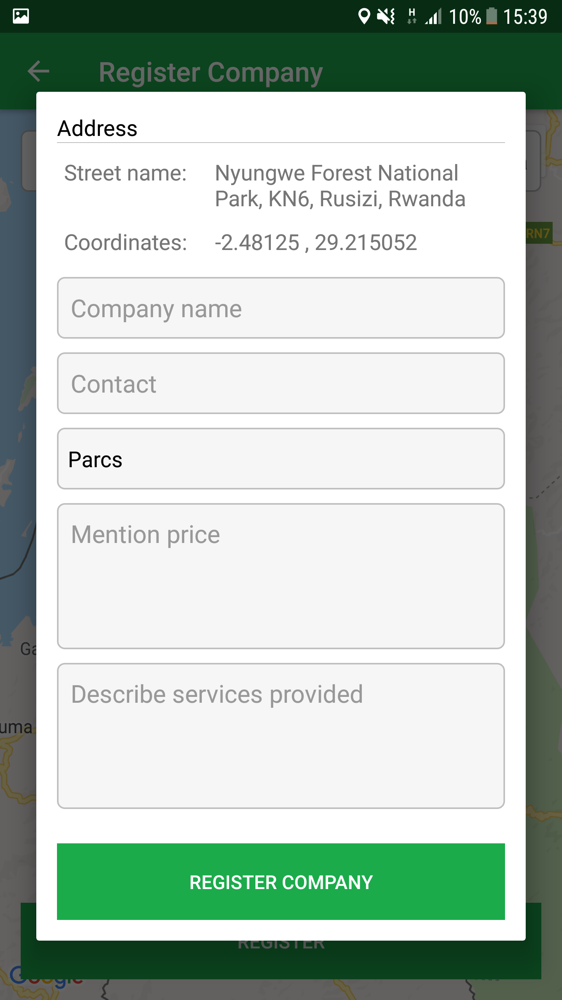

# Travel Guide Application

This application helps travels to get some location information or places address. It was not build for commercial purpose, just for student's final year poject. This application has admin and visior sides 

Some of the features have been removed for security purpose. To fork this project you have to configure some feature at your end so that you can be able to get full functionality of the application. The missing components are as follow:

1. Get google map api key and replace xxxxxxxx with your api key  `public static String GOOGLE_API_KEY = "xxxxxxxxxxxxx"` under `ynwa.guideme.Config.APP_CONFIG.java"`
2. Create a firebase project, download `google-service.json` file and paste it into app directory of this project.
3. Admin may be able to notify visitor for the made order. in order this functionality to work you have to have an sms gateway access link to send message to the user. This configuration should depends to the gateway.

## Visitor may access the following service: ##

* View interest category
* View places in a certain category
* Can share a place
* Can Make an order for a certain place
* Can view place on map the get direction using MapUtils on googleMap

  
  
  

  
  
  

## Admin can access the following services: ##

* Creating category
* Add places into category
* Can share a place
* Adding new admin user account
* View orders and notify visitor using sms for the provided phone number

  
  
  

  
  
  

